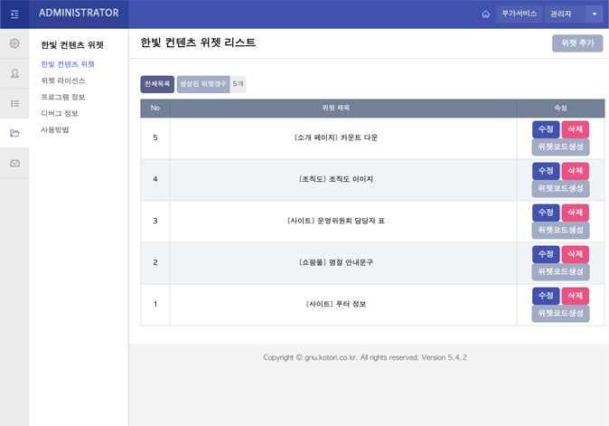

## 한빛가람 온라인 컨텐츠 관리 플러그인 0.2


## 설명
파일을 수정하지 않고, 간편하게 컨텐츠 혹은 내용관리 등을 할 수 있는 플러그인입니다.
그누보드/영카트 5.2~5.5까지 대응되지만, 5.4 미만에서는 위젯 수정 버튼이 깨지는 현상이 발생할 수 있습니다.

## 설치방법
1. 플러그인을 ~~구매 혹은~~ 다운로드 한 뒤, 압축을 해제합니다.
    1-1. 압축을 푸는 과정에서 \_\_MAC OS X\_\_ 같은 폴더가 존재하는 경우 지워줍니다.
2. 압축 해제한 파일들을 각각의 폴더로 업로드합니다.
    2-1. adm, extend, plugin 폴더 순으로 업로드 하면 됩니다.
3. 그누보드 관리자 페이지로 접속합니다.
4. 관리자 메뉴에서 '한빛 컨텐츠 위젯' 을 찾은 뒤 클릭해줍니다.


5. 설치 마법사의 지시에 따라 설치를 진행합니다.


## 기타 사용 화면
### 1. 위젯 리스트 (관리화면)


### 2. 위젯 리스트 (정보 등록 / 수정 화면)


### 3. 위젯 내용 등록 / 수정 화면


### 4. 위젯 코드 복사


## 코드 사용방법 (사례)
### 1. 최신글을 파일 수정하지 않고 바꾸고 싶을 때


### 2. 푸터를 파일 수정 없이 바꾸고 싶을 때


## 기타 오류 처리
### 1. 위젯 수정버튼이 깨져요
위젯 수정 버튼이 깨지는 경우는, 그누보드/영카트 5.4 미만이거나 그누보드의 CSS를 수정하셔서 발생하는 현상입니다.

이 현상을 해결하려면, 아래와 같이 수정하면 됩니다.

- 수정할 파일 : /plugin/hanbitgaram/widget/hanbitgaram.widget.lib.php<br>수정할 라인 : hanbitgaram_widget_template_view 함수의 $config_btn 부분의 class

- 수정 전
```php
$config_btn = '<a href="~~~~" (중략) class="btn02">위젯 (후략)</a>';
```

- 수정 후
```php
$config_btn = '<a href="~~~~" (중략) class="btn btn_admin">위젯 (후략)</a>';
```

### 상품문의 혹은 버그수정요청
- 라이선스는 <a href="https://hanb.jp/license/limit_software_2.html">한빛가람 제한적 소프트웨어 배포 라이선스 버전 2</a> 에 의해 보호됩니다.
- 본 소스코드를 공개함에 따라 버그 수정은 따로 받지 않습니다. 라이선스 내용과 별개로 본 소스코드는 기업체와 개인 모두 무료로 사용하실 수 있습니다. 외주 제작에 사용하셔도 됩니다.
- 타 솔루션에 컨버팅 하는 것도 허용합니다. 타 솔루션에 컨버팅 할거면 차라리 새로 만드는게 낫습니다.
- 그누보드, 아미나, 나리야, 굿빌더에 호환되며, 이윰빌더는 설치하기 위해서 별도의 과정을 거쳐야합니다.

### 오류 자가진단


- 오류 자가진단 페이지가 내장되어 있습니다. 컨텐츠몰 관련 내용은 무시해주세요. 오픈소스로 공개하였기 때문에 따로 문의를 받지 않습니다.